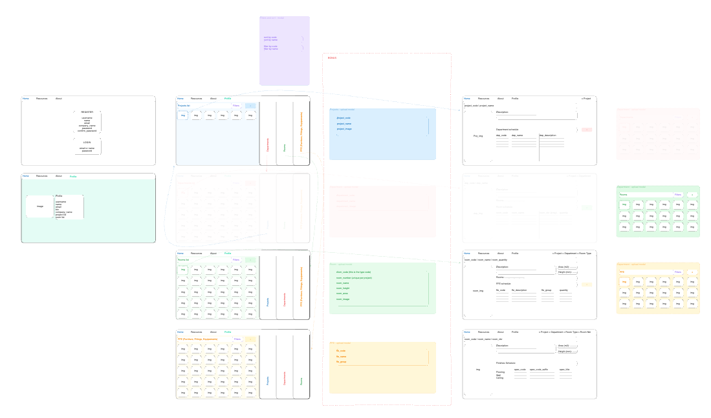
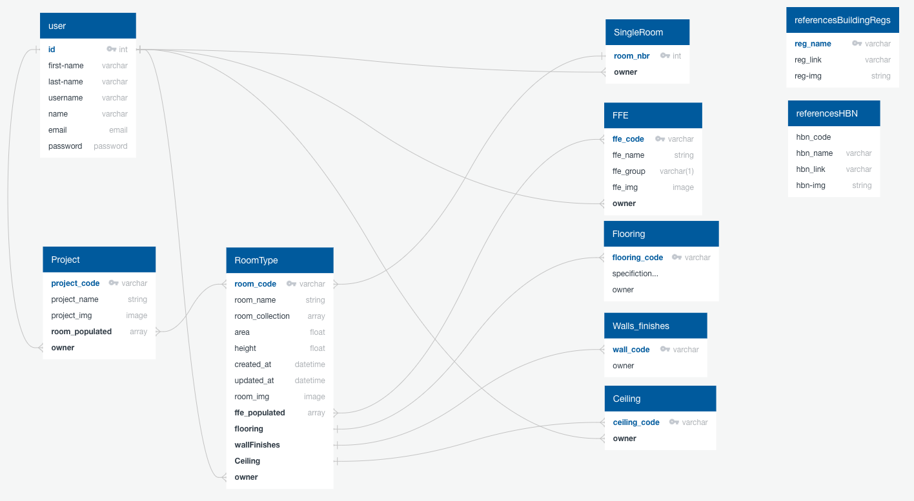
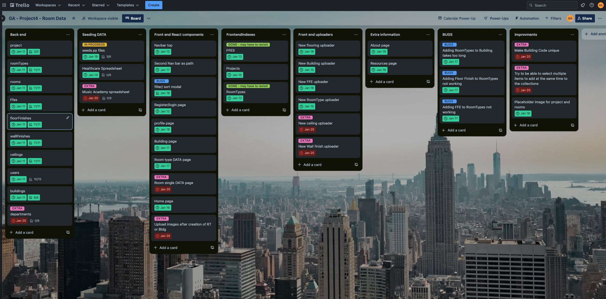
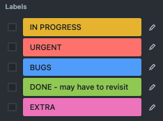
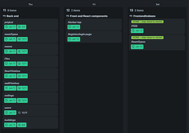
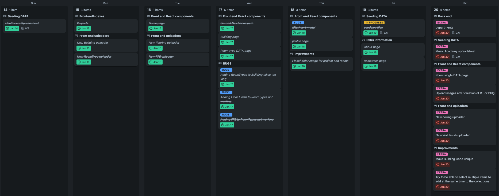
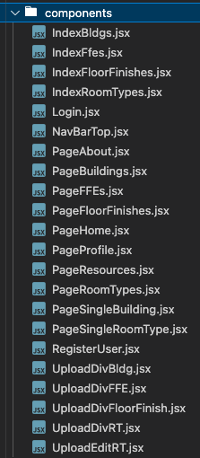
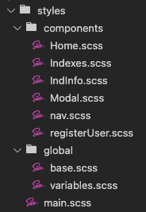

# Project 4 - BUILDING.DATA

## Description
This fourth project was a full-stack solo project. I decided to create an application that would allow architects to develop their building briefs and compile the ‘Room Data Sheets’ into one place. Indeed, in the construction public sector, when you design a building such as a hospital or a school, many rooms in the building are identical. The room types have some characteristics such as floor, wall and ceiling finishes as well as several furniture and equipment specific to that room type. This application would help the architect define these characteristics and compile the information in project-specific templates. It could also then help the quantity surveyor access the scheduled information and start the cost evaluation in parallel to the creative design development that the architect will then pursue. 

## Deployment Link
https://building-data-f6ca9aff8146.herokuapp.com/

## Packages to install
- Front-end:
node, vite, React, React-router-dom, axios, bootstrap, react bootstrap, sass, MUI, localforage, match-sorter, sort-by
- Back-end:
python, pipenv, django, psycopg2-binary, pylint, djangorestframework, django-environ, djangorestframework-simplejwt, pillow
- For deployment on Heroku:
django-on-heroku

## Timeframe
This was a solo project and I had 10 days to build a full-stack application 

## Technologies Used
HTML, CSS, JavaScript, React, Axios, Node.js, Vite, JSON, JWT, npm, Chrome DevTools, Bootstrap, MUI, Sass, Cloudinary, Heroku, python, Neon SQ, Django, PostgreSQL, insomnia, VScode.

## Brief
### Technical Requirements
- Build a full-stack application by making your own backend and your own front-end
- Use a Python Django API using Django REST Framework to serve your data from a Postgres database
- Consume your API with a separate front-end built with React
- Be a complete product which most likely means multiple relationships and CRUD functionality for at least a couple of models
- Complex Functionality like integrating a 3rd party API or using a particularly complex React Component would mean that the CRUD and multiple relationships requirement can be relaxed, speak to your instructor if you think this could be you.
- Implement thoughtful user stories/wireframes that are significant enough to help you know which features are core MVP and which you can cut
- Have a visually impressive design to kick your portfolio up a notch and have something to wow future clients & employers. ALLOW time for this.
- Be deployed online so it's publicly accessible.

## Planning
- I started by drawing the wireframe on Excalidraw and decided on some functionalities that would be developed throughout the project. For instance, what kind of information can be updated through the application such as the collection of room types to be added to a building, the collection of FFE (Furniture Fittings & equipment) to be added to a room type, specifications regarding room finishes…

    

- In parallel, I developed the ERD diagram to plan the relationships between the various databases and to understand which models are needed for the back-end applications:

    

- I was then ready for sign-off and started planning the work in Trello to manage progress and spread the tasks throughout the 10 days

    

- I used these labels to track the progress 

    

- I also made sure that all the tasks had a due date set up, which means that the alert button will automatically turn red if a task still needs to be completed by then. It also means that I can use the calendar power-up from Trello and navigate the task cards by date. These cards can then be dragged from one date to another, ensuring that no backlogs are left behind. It is also useful to visualise the workload per day/week and ensure that the weekly planning is realistic. These screenshots have been taken at the end of the project. This would have been a completely different picture.

     

## Build/Code Process
I started by building the bones of the backend:
- After having installed Django in the local project root, I was ready to enter the virtual environment shell where I could start creating the database, project app and super user (the ultimate admin).
- I can then start the various applications to follow the ERD above by 
```
django-admin startapp buildings
django-admin startapp roomTypes
django-admin startapp rooms
django-admin startapp ffes
django-admin startapp floorFinishes
django-admin startapp wallFinishes
django-admin startapp ceilings 
django-admin startapp users
django-admin startapp resourcesHBN
django-admin startapp resourcesBuildingRegs
```

- All these applications have to be added to the INSTALLED_APP list which is in Project>settings.py
- Each of these application folders has a model.py file where the class for models has to be defined. This is where the fields of the models are declared as well as their relationships if any. For instance, this RoomType model has a many-to-many relationship with the Ffe model and also has a one-to-many relationship with FloorFinishes, WallFinishes, Ceilings and User models.
```Python
class RoomType(models.Model):
   room_code = models.CharField(max_length=255)
   room_name = models.CharField(max_length=255)
   area = models.FloatField(blank=True, null=True)
   height = models.FloatField(blank=True, null=True)
   room_img = models.CharField(
       max_length=2000,
       blank=True,
       null=True
   )
   created_at = models.DateTimeField(auto_now_add=True)
   updated_at = models.DateTimeField(auto_now=True)
   ffes = models.ManyToManyField(
       blank=True,
       to='ffes.Ffe',
       related_name='roomTypes'
   )
   floorFinishes = models.ForeignKey(
       blank=True,
       null=True,
       on_delete=models.CASCADE,
       to='floorFinishes.FloorFinish',
       related_name='rooms'
   )
   wallFinishes = models.ForeignKey(
       blank=True,
       null=True,
       on_delete=models.CASCADE,
       to='wallFinishes.WallFinish',
       related_name='rooms'
   )
   ceilings = models.ForeignKey(
       blank=True,
       null=True,
       on_delete=models.CASCADE,
       to='ceilings.Ceiling',
       related_name='rooms'
   )
   owner = models.ForeignKey(
       to='users.User',
       on_delete=models.CASCADE,
       related_name='owned_roomTypes',
       null=True
   )


   def __str__(self):
       return f'{self.room_code} - {self.room_name}'
```

- Each time the Models are updated in the backend, changes have to be migrated to the database before re-running the server.
- I created a series of Google sheets with a list of room types, and FFEs (Furniture, Fittings and Equipment) that I wanted to include on the website, which would form the basic template. I would then use that to populate the JSON files to seed into the applications.
- For each application, the urls.py, the views.py, and the admin.py have to be set up as well as serializers/common.py and serialzers/populated.py if needed.
- The urls.py in the main project folder should also be updated to ensure that the routes of each application are linked

From day 2, I  was ready to start working on the client side and developing the front end in React.
- I started implementing the register/login page as I wanted the user to be logged in before accessing any data in the application
- I then also worked on the Navbar components which would allow me to navigate throughout the website
- The app.jsx remains very simple and it only returns the navbar component and then Outlet (a component from react-router-dom that renders the child route's element, if there is one). The props to pass through this Outlet component have to be declared as context properties.
```JavaScript
return (
       <>
           <NavTop userData={userData} setUserData={setUserData} />
           <main>
               {
                   navigation.state === 'idle' ?
                       <Outlet context={[userData, setUserData]} />
                       :
                       <section className='spinner'>
                           <Spinner />
                       </section>
               }
           </main>
       </>
)
```

- I then moved on to creating the indexes that I wanted to implement. (the buildings, the room types and the FFEs)
    - Each of these indexes can be filtered by searching input text
- To add items to these indexes there is an add button at the top that will open a modal. This modal will either be 
    - A form inviting you to entire the data to submit to populate the index
    - Or another index, from which you can add, add duplicates. This index in the modal can also be filtered by name to avoid having to scroll through the entire database. 
- I decided to implement all the update functionalities through modals. When:
    - Editing information such as floor finishes, wall finishes, ceilings, code and name of room types, open a form where you enter the updated data
    - Adding room types into a building or adding FFE into a room type, updates the related field building or room type 
    - These are the component files in React: 

        
- In parallel to the above, I have been doing some styling and making the pages and indexes layout cohesive. I used Sass which allowed me to use relationships between the various SCSS files and I could for instance set up the colour scheme into my variables.scss and use these variables in each component to style.

    

- On the profile page, I wanted to show more information than just the username. I also wanted the initials of the user to be displayed in the navbar at the top. This was a challenge (see first point of challenges section).

## Challenges
Accessing the User model fields from the front end:
To access this extra information I had to create a specific serializer that would extend the default TokenObtainPairSerializer from rest_framework_simplejwt.serializers. It will then overwrite the default validate function and return more than the default data attributes. I can now access all the fields defined in the User Model.
```Python
class MyTokenObtainPairSerializer(TokenObtainPairSerializer):
  def validate(self, attrs):
    attrs = super().validate(attrs)
    return {
      **attrs,
      "id":self.user.id,
      "username": self.user.username,
      "email": self.user.email,
      "first_name": self.user.first_name,
      "last_name": self.user.last_name,
      "img":self.user.img,
      "bio":self.user.bio,
      "permissions": self.user.user_permissions.values_list("codename", flat=True),
      "groups": self.user.groups.values_list("name", flat=True),
    }
```
- As the SQL server is hosted online, I had some issues with website slowness when retrieving the data. The issue wasn't only with the latency from the remote server, but the way I was accessing the data through the front-end. 
For instance:
The page for a single room type uses the loader to access all the details of this room type which are only accessed on this page where I need this information.
```JavaScript
const indRT = useLoaderData()
const {
    id: roomType_id,
    room_code,
    room_name,
    room_img,
    area,
    height,
    rooms,
    floorFinishes,
    ceilings,
    wallFinishes,
    ffes,
    owner } = indRT
```
```JavaScript
//! Functions
    async function updateRT(addedItem) {
    const ffeIDArray = ffesToUpdate.map(object => object.id)
    const ffeIDArrayPopulated = [...ffeIDArray, addedItem]
    try {
        await axios.patch(`/api/roomTypes/${roomType_id}/`, { ffes: ffeIDArrayPopulated }, {
            headers: {
                Authorization: `Bearer ${userData.access}`
            }
        })
        const updatedData = await axios.get(`/api/roomTypes/${roomType_id}/`)
        setFfesToUpdate(updatedData.data.ffes)
        setOpen(false)
    } catch (error) {
        console.log(error)
    }
}
```

- This function can be passed as props in the component:
```JavaScript
<PageFFES display={true} roomType_id={roomType_id} updateRT={updateRT}/>
export default function PageFFEs({ roomType_id, display, updateRT }) {
```

- If needed, it can be passed again in the components of the component
```JS
<UploadDivFFE roomType_id={roomType_id} updateRT={updateRT} />
```
```JS
{ffes
  .filter(roomType => roomType.owner === userData.id)
  .map(ffe => (
 <IndexFfes ffe_id={ffe.id} key={ffe.id} roomType_id={roomType_id} updateRT={updateRT} display={display} crossDisplay={true} setToDelete={setToDelete}/>
))}
```
```JS
export default function IndexFfes({ ffe_id, updateRT, display, crossDisplay, setToDelete }) {
   return (
           <Col
               className='ffe-list'
               key={ffe_id}
           >
               <p>{ffes.ffe_code}</p>
               <p>{ffes.ffe_name}</p>
               <p>{ffes.ffe_group}</p>
               <button
                   className='submitBtn'
                   style={{ display: display }}
                   onClick={(e) => {
                       e.preventDefault()
                       const addedFFE = ffe_id
                       updateRT(addedFFE)
                   }
               }
               >Add</button>
               <button
                   className='submitBtn'
                   style={{ display: crossDisplay }}
                   onClick={deleteFFE}
               >╳</button>
           </Col>
   )
```
You can see in this last indexFfes component, that I don’t need to reload all the room-type details to update the specific room-type, but instead call the function that has been passed down through the props. Otherwise, when rendering the FFE page, it would access the same populated information many times due to the map method on the ‘ffes’ array. (which is what I was originally doing and it was making the website very slow…)

## Wins
Passing functions as props, as explained in the second point of the challenges section
Using the preseeded data as templates helps the user to create copies of pre-populated room types. The user is then the owner of this copy and can execute full CRUD on this room-type instance
```JS
async function createRT(createdRoom) {
  try {
    const response = await axios.get(`/api/roomTypes/${createdRoom}/`)
    const roomToCopy = response.data
    const ffeArray = []
    roomToCopy.ffes.forEach(object => ffeArray.push(object.id))
  const res = await axios.post('/api/roomTypes/', { ...roomToCopy, room_code: `${roomToCopy.room_code}_copy`, ffes: ffeArray }, {
      headers: {
  Authorization: `Bearer ${userData.access}`,
  },
})
    updateBldg(res.data.id)
    setOpen(!open)
  } catch (error) {
    console.log(error)
  }
}
```
## Key Learnings/Takeaways
The importance of writing tests became so apparent in this project, as I broke the application so many times when adding new functionalities. 

## Bugs
I had so many bugs throughout development, that it was driving me insane. I tested the website a more than dozen times before the presentation to make sure to resolve these bugs. 
- Authorization Bearer access - I had to update the path as I had amended the backend to return more information than the default TokenObtainPairSerializer from rest_framework_simplejwt.serializers (see challenges point 1)
- I had forgotten to write the ‘/’ at the end of the URLs when executing axios.get, which somehow worked during development but not when deployed and no information was being rendered on the page.

## Future Improvements
- Disabling the buttons after they have been clicked on. Because the time response is sometimes slow, the user can lose patience and click twice on a submit button which results in uploading of the information twice and duplicating of created items.
- Using better error handling breadcrumbs
- Writing tests in parallel with writing functions in the development stage
- Control the 404 redirections from the backend instead of each page in React components. 
